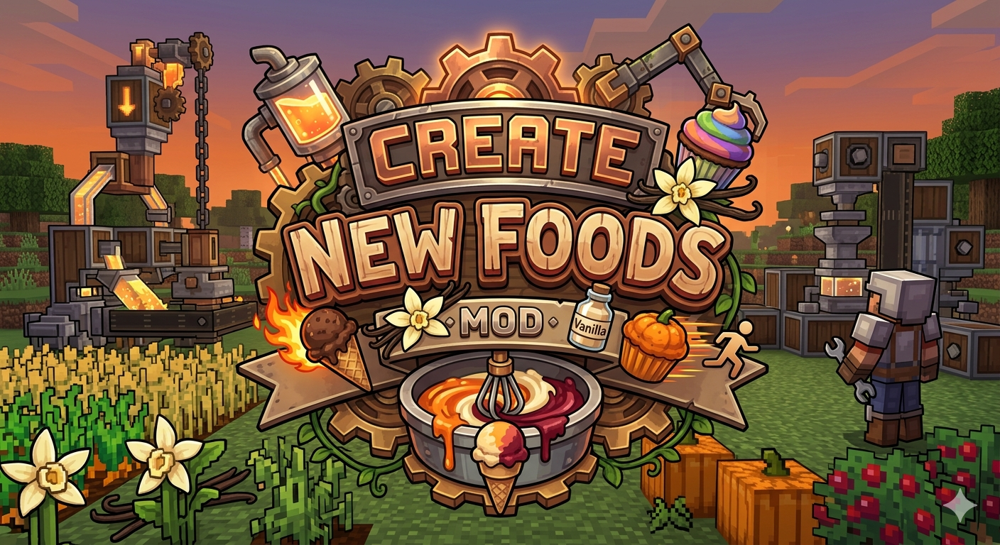

# Create: New Foods




A Fabric mod for Minecraft that extends [**Create Fly**](https://modrinth.com/mod/create-fly) and
adds new fluids, crops, food items, and Create-compatible recipes. It also adds compatibility with
[Farmer's Delight Refabricated](https://modrinth.com/mod/farmers-delight-refabricated), [More Delight](https://modrinth.com/mod/more-delight), [[Travel Friendly Food](https://modrinth.com/mod/travel-friendly-food)
and others...

**Dependencies:**
 - [**Create Fly**](https://modrinth.com/mod/create-fly)
 - [**Fabric API**](https://modrinth.com/mod/fabric-api)

**Optional dependencies:**
 - [Farmer's Delight Refabricated](https://modrinth.com/mod/farmers-delight-refabricated)
 - [More Delight](https://modrinth.com/mod/more-delight)
 - [Travel Friendly Food](https://modrinth.com/mod/travel-friendly-food)

---

## Contents

- [Crops](#crops)
  - [Apple Tree](#apple-tree-create_new_foodsapple_leaves)
  - [Vanilla](#vanilla-create_new_foodsvanilla_bean)
- [Fluids](#fluids)
- [Food Items](#food-items)
- [Recipes](#recipes)
  - [Crafting Table](#crafting-table)
  - [Create Mixing](#create-mixing)
  - [Create Filling](#create-filling)
- [Mod Compatibility](#mod-compatibility)
  - [Farmer's Delight Refabricated](#farmers-delight-refabricated)
  - [More Delight](#more-delight)
  - [Travel Friendly Food](#travel-friendly-food)

---

## Crops

### Apple Tree (`create_new_foods:apple_leaves`)

A custom apple tree that grows apples directly on its leaves.

- **Generated from:** Apple Sapling (`create_new_foods:apple_sapling`)
- **Fruit state:** Leaves can toggle between normal and apple-bearing (`has_apples=true`)
- **Growth:** Apples appear over time through random ticks while the chunk is loaded
- **Harvest:** Right-click apple-bearing leaves to collect 1 apple without destroying the leaves
- **Bone meal:** Supported on apple leaves without apples; forces apple growth
- **Create harvester:** Supported — the Create Fly harvester can collect apples from apple-bearing leaves without breaking the leaves
- **Contraption behavior:** Apple leaves are treated as pass-through for Create contraptions so orchard harvesters can move through the canopy cleanly

---

### Vanilla (`create_new_foods:vanilla_bean`)

A slow-growing orchid that produces vanilla, inspired by real-life vanilla plants.

- **Planted with:** Vanilla item (right-click on valid ground)
- **Grows on:** Grass, dirt, podzol, farmland, mud, moss and similar blocks
- **Light requirement:** Minimum level 7
- **Growth stages:** 4 (0–3)
  - Stages 0–2: single-block plant
  - Stage 3: two-block-tall plant (top block appears automatically when space is free above)
- **Growth speed:** Slow — roughly half the speed of sweet berries
- **Harvest:** Right-click at stage 3 to collect 1–2 vanilla without destroying the plant. The plant resets to stage 1.
- **Breaking:** Breaking at stage 3 also drops vanilla. Breaking at earlier stages drops nothing.
- **Bone meal:** Supported — advances one stage per use, places the top block when reaching stage 3.
- **World generation:** Spawns naturally at stage 2 in Jungle, Bamboo Jungle, Sparse Jungle, Mangrove Swamp, and Flower Forest biomes.

---

## Fluids

All fluids are flowable, can be stored in buckets, and are compatible with Create Fly tanks and mixing bowls.

| Fluid            | Bucket Item             | Fog Color |
|------------------|-------------------------|-----------|
| Pumpkin Pulp     | Pumpkin Pulp Bucket     | Orange    |
| Sweet Berry Pulp | Sweet Berry Pulp Bucket | Dark Red  |
| Vanilla          | Vanilla Bucket          | Cream     |
| Melon Pulp       | Melon Pulp Bucket       | Red       |
| Apple Pulp       | Apple Pulp Bucket       | Gold      |
| Glow Berry Pulp  | Glow Berry Pulp Bucket  | Green     |

Each fluid has a custom tint applied when the player is submerged in it.

---

## Food Items

### Ice Cream Cone (`create_new_foods:icecream_cone`)

The base item for all ice cream variants. Crafted or mixed.

### Ice Cream Variants

All variants grant nutrition 3, saturation 0.4, and are always edible.

| Item                                                           | Effect (12s)       |
|----------------------------------------------------------------|--------------------|
| Ice Cream (`create_new_foods:icecream`)                        | Fire Resistance II |
| Chocolate Ice Cream (`create_new_foods:icecream_chocolate`)    | Health Boost II    |
| Pumpkin Ice Cream (`create_new_foods:icecream_pumpkin`)        | Speed II           |
| Sweet Berry Ice Cream (`create_new_foods:icecream_sweetberry`) | Regeneration II    |
| Vanilla Ice Cream (`create_new_foods:icecream_vanilla`)        | Fire Resistance II |
| Melon Ice Cream (`create_new_foods:icecream_melon`)            | Absorption II      |
| Apple Ice Cream (`create_new_foods:icecream_apple`)            | Strength II        |
| Glow Berry Ice Cream (`create_new_foods:icecream_glow_berry`)  | Glowing II         |

---

### Cupcake (`create_new_foods:cupcake_base`)

The base item for all cupcake variants. Crafted via table or Create mixing (heated). Edible on its own (nutrition 2, saturation 0.1).

### Cupcake Variants

All variants grant nutrition 5, saturation 0.6, and are always edible.

| Item                                                          | Effect (12s)       |
|---------------------------------------------------------------|--------------------|
| Chocolate Cupcake (`create_new_foods:cupcake_chocolate`)      | Health Boost II    |
| Pumpkin Cupcake (`create_new_foods:cupcake_pumpkin`)          | Speed II           |
| Sweet Berry Cupcake (`create_new_foods:cupcake_sweetberry`)   | Regeneration II    |
| Vanilla Cupcake (`create_new_foods:cupcake_vanilla`)          | Fire Resistance II |
| Melon Cupcake (`create_new_foods:cupcake_melon`)              | Absorption II      |
| Apple Cupcake (`create_new_foods:cupcake_apple`)              | Strength II        |
| Glow Berry Cupcake (`create_new_foods:cupcake_glow_berry`)    | Glowing II         |

---

### Yogurt (`create_new_foods:yogurt`)

A dairy item crafted with milk, a glass bottle, bone meal, and sugar. Edible on its own (nutrition 4, saturation 0.5), granting Regeneration I for 8s.

### Yogurt Variants

All variants grant nutrition 5, saturation 0.6, and are always edible.

| Item                                                        | Effect (12s)       |
|-------------------------------------------------------------|--------------------|
| Pumpkin Yogurt (`create_new_foods:yogurt_pumpkin`)          | Speed II           |
| Sweet Berry Yogurt (`create_new_foods:yogurt_sweetberry`)   | Regeneration II    |
| Vanilla Yogurt (`create_new_foods:yogurt_vanilla`)          | Fire Resistance II |
| Melon Yogurt (`create_new_foods:yogurt_melon`)              | Absorption II      |
| Apple Yogurt (`create_new_foods:yogurt_apple`)              | Strength II        |
| Glow Berry Yogurt (`create_new_foods:yogurt_glow_berry`)    | Glowing II         |

---

### Juices

### Juice Variants

All juices are drinkable (nutrition 2, saturation 0.3, always edible). Consuming returns an empty glass bottle.

| Item                                                       | Effect (12s)                                                             |
|------------------------------------------------------------|--------------------------------------------------------------------------|
| Apple Juice (`create_new_foods:juice_apple`)               | Strength I                                                               |
| Glow Berry Juice (`create_new_foods:juice_glow_berry`)     | Glowing I                                                                |
| Melon Juice (`create_new_foods:juice_melon`)               | Absorption I                                                             |
| Pumpkin Juice (`create_new_foods:juice_pumpkin`)           | Speed I                                                                  |
| Sweet Berry Juice (`create_new_foods:juice_sweetberry`)    | Regeneration I                                                           |
| Tutti Frutti Juice (`create_new_foods:juice_tutti_frutti`) | Strength I, Glowing I, Absorption I, Speed I, Regeneration I (all 60s)   |

---

## Recipes

### Crafting Table

#### Ice Cream Cone (4x)
```
 M
WXW
 W
```
- `W` = Wheat (or wheat-like item, like Wheat_flour)
- `X` = Sugar
- `M` = Milk bucket

#### Ice Cream
```
 O
 X
 Y
```
- `O` = Milk
- `X` = Snowball
- `Y` = Ice Cream Cone


#### Flavored Ice Creams

All flavored ice cream variants can be crafted without Create machinery by combining an ice cream with the matching fluid bucket:

```
 X
 Y
```
- `X` = Flavor bucket
- `Y` = Ice Cream (`create_new_foods:icecream`)

| Recipe                | Bucket                  |
|-----------------------|-------------------------|
| Chocolate Ice Cream   | Chocolate Bucket        |
| Pumpkin Ice Cream     | Pumpkin Pulp Bucket     |
| Sweet Berry Ice Cream | Sweet Berry Pulp Bucket |
| Vanilla Ice Cream     | Vanilla Bucket          |
| Melon Ice Cream       | Melon Pulp Bucket       |
| Apple Ice Cream       | Apple Pulp Bucket       |
| Glow Berry Ice Cream  | Glow Berry Pulp Bucket  |


#### Yogurt (1x)

Shapeless — no specific position required:
- 1x Milk (`#create_new_foods:milk`)
- 1x Glass Bottle
- 1x Bone Meal
- 1x Sugar

#### Flavored Yogurts

```
 X
 Y
```
- `X` = Flavor bucket
- `Y` = Yogurt (`create_new_foods:yogurt`)

| Recipe              | Bucket                  |
|---------------------|-------------------------|
| Pumpkin Yogurt      | Pumpkin Pulp Bucket     |
| Sweet Berry Yogurt  | Sweet Berry Pulp Bucket |
| Vanilla Yogurt      | Vanilla Bucket          |
| Melon Yogurt        | Melon Pulp Bucket       |
| Apple Yogurt        | Apple Pulp Bucket       |
| Glow Berry Yogurt   | Glow Berry Pulp Bucket  |

---

#### Juices

Shapeless — combine a Water Potion (bottle) with the matching pulp bucket:

| Recipe                | Ingredient              |
|-----------------------|-------------------------|
| Apple Juice           | Apple Pulp Bucket       |
| Glow Berry Juice      | Glow Berry Pulp Bucket  |
| Melon Juice           | Melon Pulp Bucket       |
| Pumpkin Juice         | Pumpkin Pulp Bucket     |
| Sweet Berry Juice     | Sweet Berry Pulp Bucket |

#### Tutti Frutti Juice

Shapeless — combine a Water Potion (bottle) with all five pulp buckets:
- 1x Potion
- 1x Apple Pulp Bucket
- 1x Glow Berry Pulp Bucket
- 1x Melon Pulp Bucket
- 1x Pumpkin Pulp Bucket
- 1x Sweet Berry Pulp Bucket

---

#### Cupcake (1x)

Shapeless — no specific position required:
- 1x Wheat-like item (`#create_new_foods:wheat_like`)
- 1x Water Bucket
- 1x Milk (`#create_new_foods:milk`)
- 1x Egg
- 1x Sugar

#### Flavored Cupcakes

```
 X
 Y
```
- `X` = Frosting bucket
- `Y` = Cupcake (`create_new_foods:cupcake_base`)

| Recipe              | Bucket                  |
|---------------------|-------------------------|
| Chocolate Cupcake   | Chocolate Bucket        |
| Pumpkin Cupcake     | Pumpkin Pulp Bucket     |
| Sweet Berry Cupcake | Sweet Berry Pulp Bucket |
| Vanilla Cupcake     | Vanilla Bucket          |
| Melon Cupcake       | Melon Pulp Bucket       |
| Apple Cupcake       | Apple Pulp Bucket       |
| Glow Berry Cupcake  | Glow Berry Pulp Bucket  |

---

### Create Mixing

All mixing recipes require the **Create** mod.

#### Ice Cream Cone (4x)
- 1x wheat-like item
- 1x sugar
- 125 mB milk fluid

#### Cupcake (4x) — requires heat
- 1x dough (`#c:foods/dough`)
- 1x egg
- 1x sugar
- 250 mB milk fluid

#### Pumpkin Pulp
- 1x Pumpkin + 1x Sugar

#### Sweet Berry Pulp
- 4x Sweet Berries + 1x Sugar

#### Melon Pulp
- 1x Melon + 1x Sugar

#### Melon Pulp (slices)
- 4x Melon Slice + 1x Sugar

#### Apple Pulp
- 4x Apple + 1x Sugar

#### Glow Berry Pulp
- 4x Glow Berries + 1x Sugar

#### Vanilla
- 2x Vanilla + 1x Sugar

All pulp and vanilla fluid recipes produce **1,000 mB** of fluid. No heat required.

---

### Create Filling

Filling recipes are performed in a Create Spout or filling machine.

| Recipe                | Ingredient     | Fluid (20,250 mB)                                 | Result                |
|-----------------------|----------------|---------------------------------------------------|-----------------------|
| Ice Cream             | Ice Cream Cone | Milk (`#c:milk`)                                  | Ice Cream             |
| Chocolate Ice Cream   | Ice Cream      | Chocolate (`#c:chocolate`)                        | Chocolate Ice Cream   |
| Pumpkin Ice Cream     | Ice Cream      | Pumpkin Pulp (`#create_new_foods:pumpkin`)        | Pumpkin Ice Cream     |
| Sweet Berry Ice Cream | Ice Cream      | Sweet Berry Pulp (`#create_new_foods:sweetberry`) | Sweet Berry Ice Cream |
| Vanilla Ice Cream     | Ice Cream      | Vanilla (`#create_new_foods:vanilla`)             | Vanilla Ice Cream     |
| Melon Ice Cream       | Ice Cream      | Melon Pulp (`#create_new_foods:melon`)            | Melon Ice Cream       |
| Apple Ice Cream       | Ice Cream      | Apple Pulp (`#create_new_foods:apple`)            | Apple Ice Cream       |
| Glow Berry Ice Cream  | Ice Cream      | Glow Berry Pulp (`#create_new_foods:glow_berry`)  | Glow Berry Ice Cream  |
| Chocolate Cupcake     | Cupcake        | Chocolate (`#c:chocolate`)                        | Chocolate Cupcake     |
| Pumpkin Cupcake       | Cupcake        | Pumpkin Pulp (`#create_new_foods:pumpkin`)        | Pumpkin Cupcake       |
| Sweet Berry Cupcake   | Cupcake        | Sweet Berry Pulp (`#create_new_foods:sweetberry`) | Sweet Berry Cupcake   |
| Vanilla Cupcake       | Cupcake        | Vanilla (`#create_new_foods:vanilla`)             | Vanilla Cupcake       |
| Melon Cupcake         | Cupcake        | Melon Pulp (`#create_new_foods:melon`)            | Melon Cupcake         |
| Apple Cupcake         | Cupcake        | Apple Pulp (`#create_new_foods:apple`)            | Apple Cupcake         |
| Glow Berry Cupcake    | Cupcake        | Glow Berry Pulp (`#create_new_foods:glow_berry`)  | Glow Berry Cupcake    |
| Pumpkin Yogurt        | Yogurt         | Pumpkin Pulp (`#create_new_foods:pumpkin`)        | Pumpkin Yogurt        |
| Sweet Berry Yogurt    | Yogurt         | Sweet Berry Pulp (`#create_new_foods:sweetberry`) | Sweet Berry Yogurt    |
| Vanilla Yogurt        | Yogurt         | Vanilla (`#create_new_foods:vanilla`)             | Vanilla Yogurt        |
| Melon Yogurt          | Yogurt         | Melon Pulp (`#create_new_foods:melon`)            | Melon Yogurt          |
| Apple Yogurt          | Yogurt         | Apple Pulp (`#create_new_foods:apple`)            | Apple Yogurt          |
| Glow Berry Yogurt     | Yogurt         | Glow Berry Pulp (`#create_new_foods:glow_berry`)  | Glow Berry Yogurt     |
| Apple Juice           | Potion         | Apple Pulp (`#create_new_foods:apple`)            | Apple Juice           |
| Glow Berry Juice      | Potion         | Glow Berry Pulp (`#create_new_foods:glow_berry`)  | Glow Berry Juice      |
| Melon Juice           | Potion         | Melon Pulp (`#create_new_foods:melon`)            | Melon Juice           |
| Pumpkin Juice         | Potion         | Pumpkin Pulp (`#create_new_foods:pumpkin`)        | Pumpkin Juice         |
| Sweet Berry Juice     | Potion         | Sweet Berry Pulp (`#create_new_foods:sweetberry`) | Sweet Berry Juice     |

---

## Mod Compatibility

### Farmer's Delight Refabricated

When [Farmer's Delight Refabricated](https://modrinth.com/mod/farmers-delight-refabricated) is installed alongside this mod, additional Create recipes are unlocked for 
Farmer's Delight items — both **mixing** recipes (via the mixer) and **cutting** recipes (via the mechanical saw). 
All recipes require both **Create** and **Farmer's Delight**.

> These recipes also fix the missing-recipe bug present in Farmer's Delight Refabricated v3.4.2. The warning still appears
> but the recipes work nonetheless.

#### Create Mixing Recipes _(mixer)_

| Recipe        | Ingredients                           | Heat     | Result                   |
|---------------|---------------------------------------|----------|--------------------------|
| Pumpkin Pulp  | 4x Pumpkin Slice + 1x Sugar           | None     | 1,000 mB Pumpkin Pulp    |
| Wheat Dough   | 3x Wheat Flour + 1x Egg               | None     | 3x Wheat Dough           |
| Cabbage Leaf  | 1x Cabbage                            | None     | 2x Cabbage Leaf          |
| Pie Crust     | 1x Dough + 250 mB Milk                | Heated   | 1x Pie Crust             |
| Apple Cider   | 2x Apple + 1x Sugar + 1x Glass Bottle | Heated   | 1x Apple Cider           |
| Tomato Sauce  | 2x Tomato + 1x Bowl                   | None     | 1x Tomato Sauce          |

#### Create Cutting Recipes _(mechanical saw)_

| Recipe              | Ingredient                                     | Result                                |
|---------------------|------------------------------------------------|---------------------------------------|
| Raw Pasta           | Any dough (`#c:foods/dough`)                   | 1x Raw Pasta                          |
| Minced Beef         | Raw Beef (`minecraft:beef`)                    | 2x Minced Beef                        |
| Pumpkin Slice       | Pumpkin (`minecraft:pumpkin`)                  | 4x Pumpkin Slice                      |
| Chicken Cuts        | Raw Chicken (`minecraft:chicken`)              | 2x Chicken Cuts + 1x Bone Meal        |
| Cooked Chicken Cuts | Cooked Chicken                                 | 2x Cooked Chicken Cuts + 1x Bone Meal |
| Cabbage Leaf        | Cabbage (`farmersdelight:cabbage`)             | 2x Cabbage Leaf                       |
| Cod Slice           | Raw Cod (`minecraft:cod`)                      | 2x Cod Slice + 1x Bone Meal           |
| Cooked Cod Slice    | Cooked Cod (`minecraft:cooked_cod`)            | 2x Cooked Cod Slice + 1x Bone Meal    |
| Salmon Slice        | Raw Salmon (`minecraft:salmon`)                | 2x Salmon Slice + 1x Bone Meal        |
| Cooked Salmon Slice | Cooked Salmon                                  | 2x Cooked Salmon Slice + 1x Bone Meal |
| Mutton Chops        | Raw Mutton (`minecraft:mutton`)                | 2x Mutton Chops                       |
| Cooked Mutton Chops | Cooked Mutton                                  | 2x Cooked Mutton Chops                |
| Apple Pie Slice     | Apple Pie (`farmersdelight:apple_pie`)         | 4x Apple Pie Slice                    |
| Chocolate Pie Slice | Chocolate Pie (`farmersdelight:chocolate_pie`) | 4x Chocolate Pie Slice                |
| Kelp Roll Slice     | Kelp Roll (`farmersdelight:kelp_roll`)         | 3x Kelp Roll Slice                    |

#### Create Filling Recipes _(spout)_

| Recipe    | Ingredient                             | Fluid (250 mB)                         | Result                                 |
|-----------|----------------------------------------|----------------------------------------|----------------------------------------|
| Apple Pie | Pie Crust (`farmersdelight:pie_crust`) | Apple Pulp (`#create_new_foods:apple`) | Apple Pie (`farmersdelight:apple_pie`) |

---

### More Delight

When [More Delight](https://modrinth.com/mod/more-delight) is installed, a corrected Create **cutting** recipe is provided for diced potatoes. 
More Delight ships its own recipe but uses incorrect field names that Create silently ignores; this mod overrides it with the correct format.

> Requires both **Create** and **More Delight**.

#### Create Cutting Recipes _(mechanical saw)_

| Recipe         | Ingredient                    | Result            |
|----------------|-------------------------------|-------------------|
| Diced Potatoes | Potato (`minecraft:potato`)   | 1x Diced Potatoes |
| Bread Slice    | Bread (`minecraft:bread`)     | 4x Bread Slice    |

#### Create Filling Recipes _(spout)_

| Recipe                   | Ingredient                  | Fluid (250 mB)                                    | Result                   |
|--------------------------|-----------------------------|---------------------------------------------------|--------------------------|
| Toast with Honey         | Toast (`moredelight:toast`) | Honey (`#c:honey`)                                | Toast with Honey         |
| Toast with Sweet Berries | Toast (`moredelight:toast`) | Sweet Berry Pulp (`#create_new_foods:sweetberry`) | Toast with Sweet Berries |
| Toast with Glow Berries  | Toast (`moredelight:toast`) | Glow Berry Pulp (`#create_new_foods:glow_berry`)  | Toast with Glow Berries  |
| Toast with Chocolate     | Toast (`moredelight:toast`) | Chocolate (`#c:chocolate`)                        | Toast with Chocolate     |

---

### Travel Friendly Food

When [Travel Friendly Food](https://modrinth.com/mod/travel-friendly-food) is installed alongside this mod, the following compatibility features are activated automatically:

#### Status Effect Bonuses

TFF's overlapping items gain the same status effects as their Create: New Foods equivalents:

| TFF Item                | Effect applied (12s)   |
|-------------------------|------------------------|
| Vanilla Ice Cream       | Fire Resistance II     |
| Chocolate Ice Cream     | Health Boost II        |
| Sweet Berry Ice Cream   | Regeneration II        |
| Vanilla Cupcake         | Fire Resistance II     |
| Chocolate Cupcake       | Health Boost II        |
| Sweet Berry Cupcake     | Regeneration II        |

#### Create Filling Recipes _(requires Create)_

TFF's flavored items can be produced using the Create filling machine, using your Ice Cream or Cupcake base:

| Recipe                      | Ingredient | Fluid (250 mB)                                    | Result                |
|-----------------------------|------------|---------------------------------------------------|-----------------------|
| Vanilla Ice Cream (TFF)     | Ice Cream  | Vanilla (`#create_new_foods:vanilla`)             | Vanilla Ice Cream     |
| Chocolate Ice Cream (TFF)   | Ice Cream  | Chocolate (`#c:chocolate`)                        | Chocolate Ice Cream   |
| Sweet Berry Ice Cream (TFF) | Ice Cream  | Sweet Berry Pulp (`#create_new_foods:sweetberry`) | Sweet Berry Ice Cream |
| Vanilla Cupcake (TFF)       | Cupcake    | Vanilla (`#create_new_foods:vanilla`)             | Vanilla Cupcake       |
| Chocolate Cupcake (TFF)     | Cupcake    | Chocolate (`#c:chocolate`)                        | Chocolate Cupcake     |
| Sweet Berry Cupcake (TFF)   | Cupcake    | Sweet Berry Pulp (`#create_new_foods:sweetberry`) | Sweet Berry Cupcake   |
